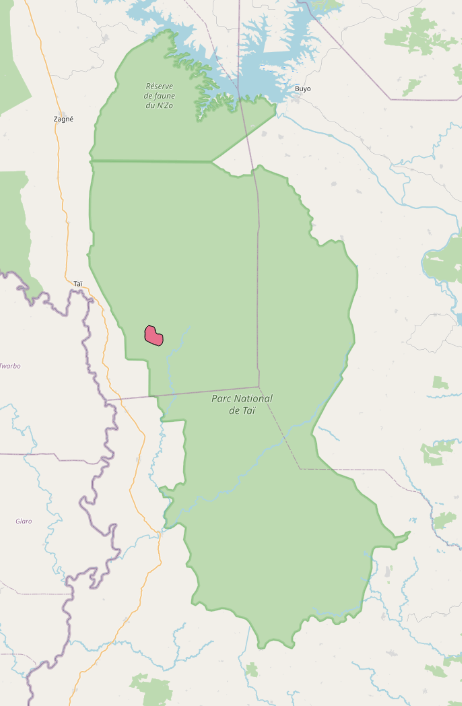
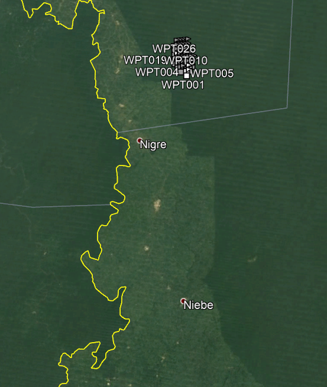

```{r include=FALSE}
knitr::opts_chunk$set(eval=TRUE, echo=TRUE, message=FALSE, warnings=FALSE)
solution <- TRUE
```

# Analysis of camera trapping data using distance sampling

Using the duiker study described by @howeetal, this practical helps to design a camera trap distance sampling survey in terms of intensity and spatial arrangement.  We start by visualising the study area in C&ocirc;te d'Ivoire, where the cameras were deployed according to a systematic grid design with a random start and a 1km spacing between sampling locations.

```{r map, fig.cap="Study area used by @howeetal", echo=FALSE}

```

Maxwell’s duikers were sampled for about 12 weeks using Bushnell camera traps (Model 119576C that gave a horizontal angle of view of 42°) mounted at an orientation of 0° and a height of 0.7–1.0m, and set to high sensitivity. We will treat the study of @howeetal as a preliminary study and use the estimates from that study to help design a subsequent study building upon information from the previous study. Note that ideally your camera traps should have similar characteristics to those used in the previous study, otherwise you will need to account for that during your design process. Similarly, deploying your cameras with a different orientation or a different height will influence the detectability of your target species of Maxwell’s duikers. 

# Effort needed for desired precision

@Buckland2015 provide formulas to compute precision achieved from varying levels of sampling effort.

$$K_{target} = \frac{K_{pilot}cv_{pilot}^2}{cv_{target}^2} $$
where

- $K_{target}$ necessary number of camera stations
- $K_{pilot}$ number of stations in initial study (21 in @howeetal)
- $cv_{pilot}$ coefficient of variation achieved in initial study (0.27 in @howeetal)
- $cv_{target}$ coefficient of variation desired for final study


We use this formula for point transect sampling in conjunction with the survey design employed in @howeetal to estimate number of camera trap stations needed to estimate duiker density with a desired level of precision.

```{r encounter, eval=FALSE, echo=FALSE}
rate <- 3.27e-4 / 2  # because snapshot duration is 2sec
#  therefore mean number of detections per second
hours <- 12
rate.per.day <- round(rate * hours * 60 * 60)
print(rate.per.day) # detections per camera per day ?
# duration <- 90 # days
# rate.per.3mos <- round(rate.per.day * duration)
# print(rate.per.3mos)
```

```{r howmany, eval=solution}
library(dssd)
K0 <- 21
cv.howe <- 0.27
cv.target <- 0.20
K.target <- K0 * cv.howe^2 / cv.target^2
```

Use this calculation, to estimate the number of stations needed to achieve a CV of 0.20.

```{r answer, eval=solution, echo=FALSE}
paste("Number of camera stations to achieve CV of 0.20 =", round(K.target))
```


```{r reasonable, eval=FALSE, echo=FALSE}
calculate.effort(21, 40, line.point="point")
calculate.effort(21, 40, line.point="point", cv.values = .27)
stations20 <- round(calculate.effort(21, 40, line.point="point", cv.values = .2)$Effort)
stations10 <- round(calculate.effort(21, 40, line.point="point", cv.values = .1)$Effort)
stations27 <- round(calculate.effort(21, 40, line.point="point", cv.values = .27)$Effort)
```

Contrast this estimate of necessary stations for duikers with those of @cappelle_estimating_2021 for a ~90 day camera deployment (Fig. 5a).

Using the `dssd` (distance sampling survey design) package you can create survey designs, as we will in a moment, and also investigate the relationship between precision and spatial sampling intensity (number of locations in our case) using the calculate.effort function. This function takes information on the number of detections and effort (number of camera sampling locations in this case) from a pilot study, along with information on the dispersion parameter (also known as the variance inflation factor). If the target species were completely evenly distributed across the area of interest and detectability did not differ by location, then the dispersion parameter would be approximately one. There is generally a great deal of variability in camera trap data and the degree of overdispersion can be approximated by $n_{pilot} \cdot cv^2_{pilot}$. Maxwell’s duikers sleep or rest for most of each night, so @howeetal recorded 11,180 distances from 6:30:00 to 17:59:59 using a 2 second time step during that interval. In the final analysis after truncation of the data 10,284 remained and we know the number of stations and the precision associated with this study. We can approximate the dispersion parameter value and examine the possible general relationship between the coefficient of variation and the number of sampling locations.

```{r dispersion, eval=solution}
dispersion <- 10284*(0.27)^2
calculate.effort(L0=21, n0=10284, q=dispersion, line.point="point")
```

You should see the target CV of 0.20 highlighted on the resulting graph.

# Spatial arrangement of camera stations

Having computed the necessary amount of sampling effort ($K_{target}$) to achieve the CV of 0.20, the next component of survey design is placement of cameras upon the landscape. @laguardia_assessing_2021 and others advocate a systematic arrangement of sampling stations across a study area.  We will use the `dssd` package to systematically place the desired number of stations throughout the study area.

First step is to import a shape file of the study area, which I created using QGIS.  The original shape file used the WGS84 datum.  The shape file needs to be projected flat such that the units of measure are not distorted; I have chosen a simple Albers Equal Area projection (see `proj4string` below).  The projected shape file is a `region` available to the `dssd` package via `make.region`

```{r getshape, eval=solution}
library(dssd)
library(sf)
duikers <- "nice.shp"
incoming <- read_sf(duikers)
original.projection <- st_crs(incoming)
proj4string <- "+proj=aea +lat_1=56 +lat_2=62 +lat_0=50 +lon_0=-3 +x_0=0 +y_0=0 +ellps=intl +units=m"
pro <- st_transform(incoming, crs=proj4string)
theduikers <- make.region(region.name="Duikers", units="m",
                          shape=pro)
```

With preliminaries concluded, the real utility of the `dssd` package comes to the fore.  The function `make.design` specifies the region, type of transects, type of design.  We also specify the distance to which cameras can detect duikers (this is used to compute proportion of the study area covered by sampling effort).  Finally, we specify the argument indicating the number of camera stations we desire.  This value was computed earlier so as to provide a target CV of 0.20.

With the design specified, the software will produce a random realisation of this design in the object `thepoints` and produce a simple plot of the points overlaid in the study area.

```{r thedesign, fig.height=5, fig.cap="Systematic design of cameras to achieve CV of 0.20", eval=solution}
mydesign <- make.design(region = theduikers,
                        transect.type = "point",
                        design = "systematic",
                        truncation = 15,
                        samplers = K.target)
thepoints <- generate.transects(mydesign)
plot(theduikers, thepoints, covered.area=TRUE)
```

# Export locations for use in the field

To navigate in the field to the designated coordinates, the locations depicted above can be exported to a GPX file format for download to handheld GPS units.

```{r togpx, eval=solution}
write.transects(thepoints,
                dsn = "camera-locations.gpx",
                layer = "points",
                dataset.options = "GPX_USE_EXTENSIONS=yes",
                proj4string = original.projection)
```

```{r googleearth, eval=TRUE, fig.cap="Camera station coordinates as gpx file viewed with Google Earth.", echo=FALSE}

```

# Alternative visualisation

Location of samplers can be overlaid onto various base maps using the `leaflet` package for use in reports.  In HTML form, the resulting figures are interactive, i.e., can be zoomed and panned and measurements can be taken using the tool in the upper right corner.

```{r leaflet, fig.cap="Example deployment of cameras necessary to achieve CV of 0.20.", fig.height=6, eval=solution}
library(leaflet)
m <- leaflet() %>% addProviderTiles(providers$OpenTopoMap)
m <- m %>% 
  setView(-7.29, 5.76, zoom=9.5) %>%
  addMeasure(
    position = "topright",
    primaryLengthUnit = "meters",
    primaryAreaUnit = "hectares",
    activeColor = "#3D535D",
    completedColor = "#7D4479")
tmp <- st_transform(thepoints@samplers, "+init=epsg:4326")
rawlat.long <- st_coordinates(tmp)
new <- cbind(tmp, rawlat.long)
new$label <-paste(round(new$X,3), round(new$Y,3), sep=", ")
icons <- awesomeIcons(
  icon = 'camera',
  iconColor = 'white',
  markerColor = "blue",
  library = 'fa'
)
m <- addAwesomeMarkers(m, data=new, icon=icons, 
                       label = ~as.character(new$label))
m <- addCircles(m, data=tmp, radius=15,color = 'red', weight = 2)
m
```

# Additional considerations

- The $cv_{target}$ used in the practical exercise accounted for the uncertainty associated with encounter rate and detectability. What difference might accounting for the uncertainty associated with temporal availability of Maxwell’s duikers (that are known to rest for shorter periods even during the day) make in the design process? 
- If you wanted to design a multi-species survey that included species that were considerably rarer that Maxwell’s duikers, then what other options might you consider aside from adding more point locations to your survey design?
- If the rare species of interest is individually identifiable, then how might you augment your camera trap distance sampling design to obtain a robust and adequately precise estimate of density and abundance?
- Given that the vast majority of the variance in the density estimate is due to variation in encounter rate between sampling locations, could you use camera trap data from previous surveys in your study area, where distances to animals were not measures, to estimate the effort required for a planned camera trap distance sampling survey?

